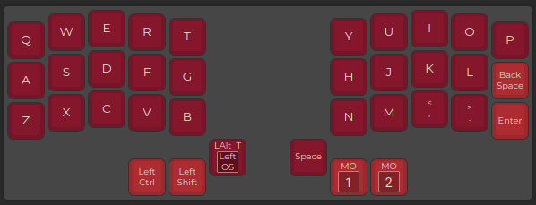
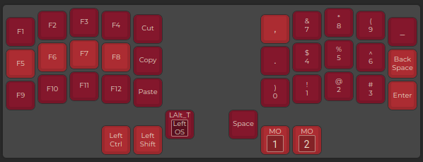
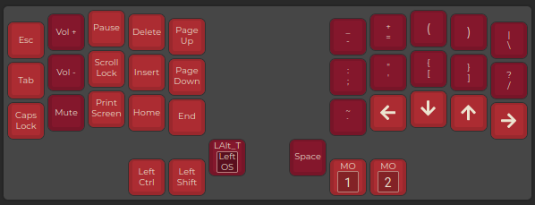

# QMK firmware for my Microdox (microdox bud from boardsource.xyz)
---

## Layers
- QWERTY (Layer 0)

- FN & Numpad (Layer 1)

- Navigation, Media & Punctuation (Layer 2)

---

## Features
- ctrl, shift, alt, os, and space accessible from all layers
- Numpad layout with dedicated comma period, and underscore included
- Modifier keys in left thumb cluster
- Layer keys in right thumb cluster (layers active as long as modifier is held)
- vim style arrow keys, though not mapped to the traditional hjkl
